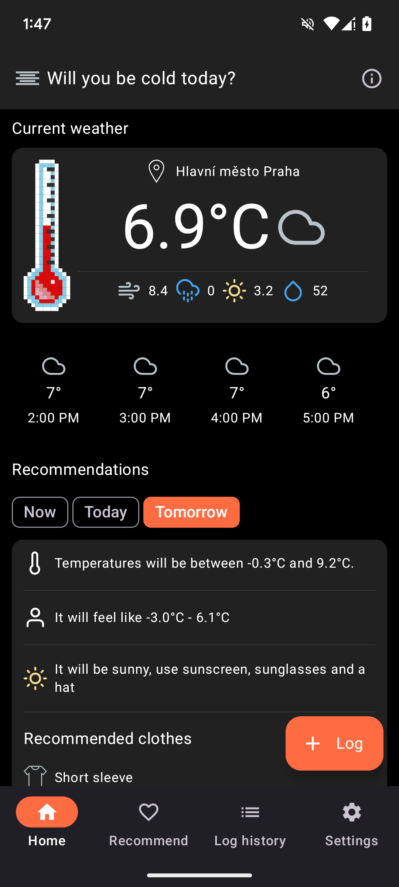
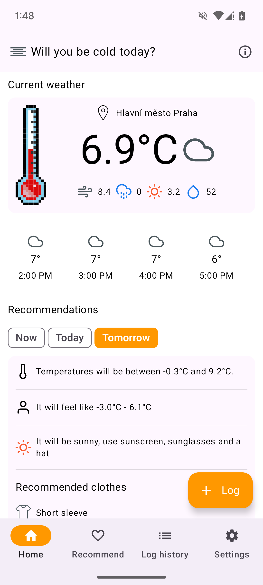
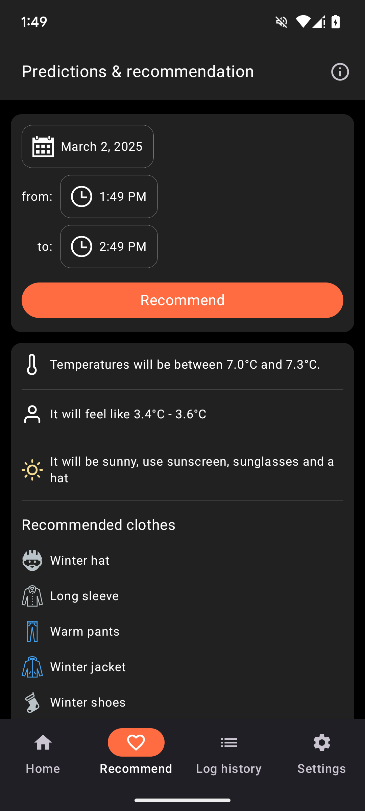
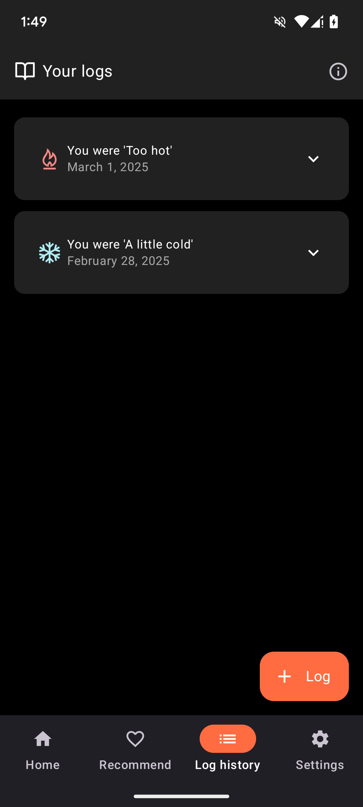
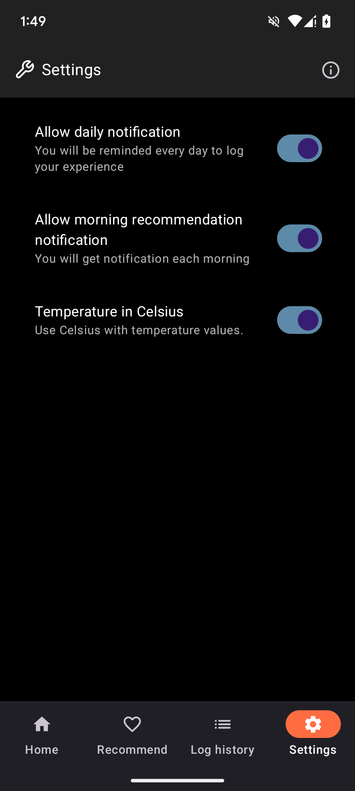
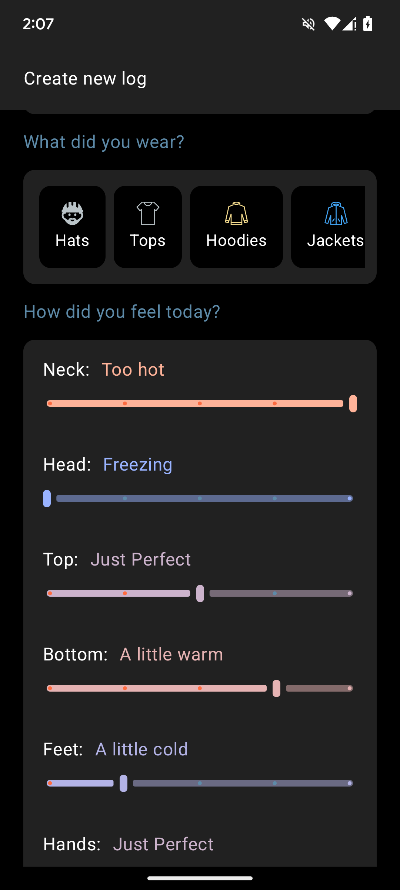

# You will be cold, trust me
A weather application that provides weather forecasts and personalized outfit recommendations based on user feedback. Over time, the app learns from user input to improve suggestions.

## Features
**Weather Forecasts**: Displays real and apparent temperature, wind speed, humidity, UV index, and precipitation chance for current weather. Also provides hourly temperature forecasts for the next 24 hours. As part of recommendation it also shows temperatures and apparent temperatures for the specified future.

**Personalized Outfit Recommendations**: Suggests clothing items (tops, bottoms, accessories, etc.) based on current or future weather conditions and past user feedback.

**Rain and UV**: Rain probability and UV index are taken into account when making recommendations for the day.

**User Feedback Logging**: Allows users to log what they wore and how they felt to refine future recommendations.

**Heuristic-Based Suggestions**: Uses predefined warmth weights and user logs to improve accuracy of prediction.

**Dark Mode**: Supports both light and dark mode.

**Celsius and Fahrenheit support**: Supports both temperature units.

**Reminder notification**: User can enable reminder notification to log their outfit from today. This notification is shown at 20:00 in the evening. In future versions we will consider customization options.

**Recommendation notification**: User can enable recommendation notification to get weather information and outfit recommendations for the day. This notification is shown at 7:00 in the morning. In future versions we will consider customization options.

## Screenshots
    

  

   

## Tech Stack
Kotlin

Coroutines

Jetpack Compose

Room

Data Store

Koin

Retrofit

Work Manager

Uses https://open-meteo.com/ API for weather data

## License
MIT License

## Notes
The app currently does not support remote backup and restore of user logs. This feature might be considered as an addition in the future.
